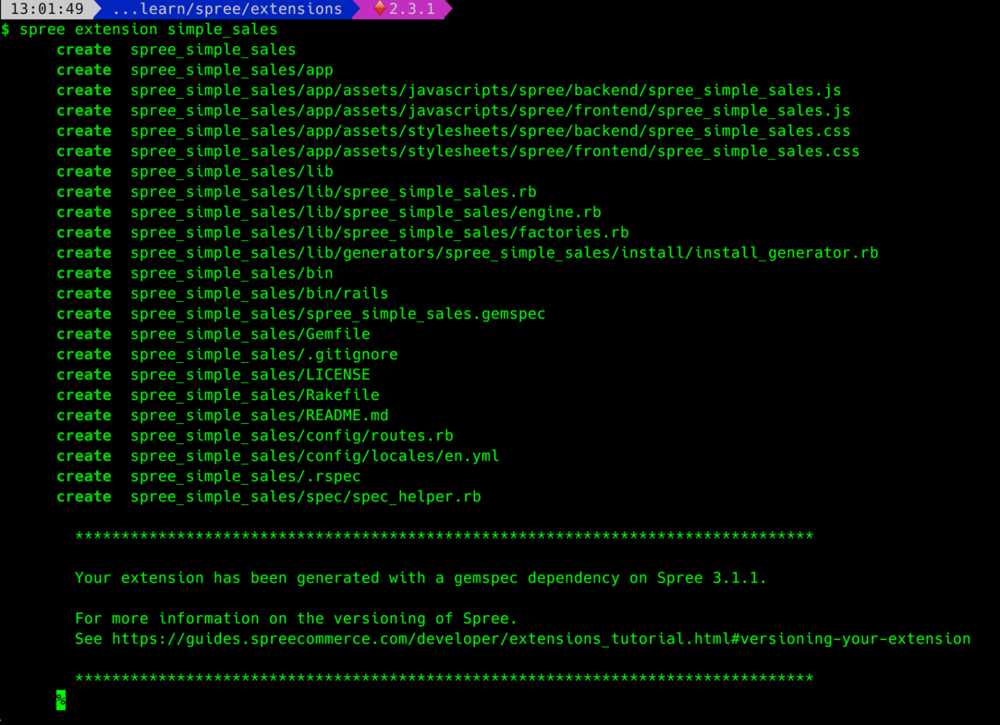
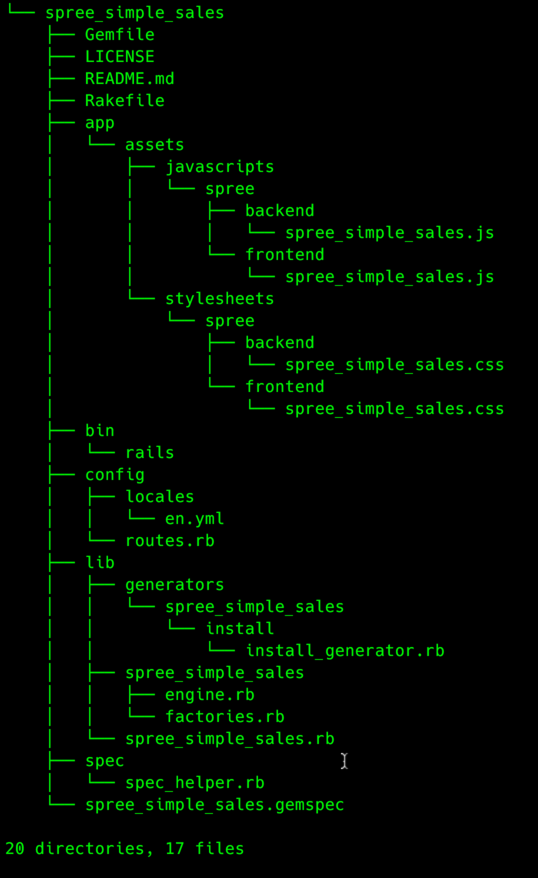
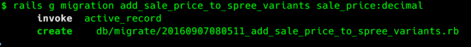
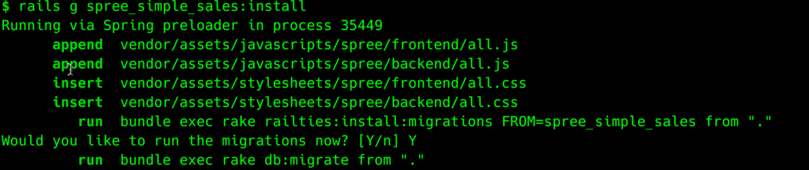
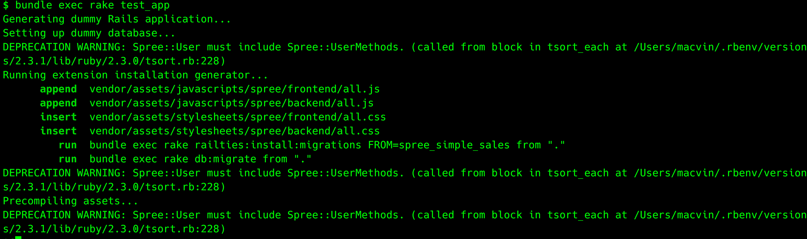

# CREATING A SPREE EXTENSION

This example is taken from [here](http://guides.spreecommerce.org/developer/extensions_tutorial.html#creating-an-extension)

Requirements
 - Ability to mark certain products as being on sale.
 - Ability to set a sale price on a given product.
 - Show products that are on sale on a separate products page

## GENERATING THE EXTENSION

Navigate to some directory **other than your store directory** and run `spree extension <your_extension_name>`

```
spree extension simple_sales
```


The above command generates an initial tree structure as show below



---

#### GEMFILE

The initial Gemfile for the extension points to the master branch.

```ruby
source 'https://rubygems.org'

gem 'spree', github: 'spree/spree', branch: 'master'
# Provides basic authentication functionality for testing parts of your engine
gem 'spree_auth_devise', github: 'spree/spree_auth_devise', branch: 'master'

gemspec
```

You may go ahead and change it to match the version which you have for your app.

```ruby
source 'https://rubygems.org'

gem 'spree', '~> 3.1'
gem 'spree_auth_devise', '~> 3.0'

gemspec
```

Notice the `gemspec` at the end of your Gemfile. *That's the next file we need to modify.*

---

#### spree_simple_sales.gemspec

You need to update gemspec file with some basic information before you are able to run bundle install.

The final version looks something like :

```ruby
# encoding: UTF-8
Gem::Specification.new do |s|
  s.platform    = Gem::Platform::RUBY
  s.name        = 'spree_simple_sales'
  s.version     = '3.1.1'
  s.summary     = 'A demo extension based on spree tutorial'
  s.description = 'A demo extension based on spree tutorial'
  s.required_ruby_version = '>= 2.1.0'

  s.author    = 'Anurag Jain'
  s.email     = 'anurag@vinsol.com'
  # s.homepage  = 'http://www.spreecommerce.com'
  s.license = 'BSD-3'

  # s.files       = `git ls-files`.split("\n")
  # s.test_files  = `git ls-files -- {test,spec,features}/*`.split("\n")
  s.require_path = 'lib'
  s.requirements << 'none'

  s.add_dependency 'spree_core', '~> 3.1.1'

  s.add_development_dependency 'capybara', '~> 2.6'
  s.add_development_dependency 'coffee-rails'
  s.add_development_dependency 'database_cleaner'
  s.add_development_dependency 'factory_girl', '~> 4.5'
  s.add_development_dependency 'ffaker'
  s.add_development_dependency 'rspec-rails', '~> 3.4'
  s.add_development_dependency 'sass-rails', '~> 5.0.0'
  s.add_development_dependency 'selenium-webdriver'
  s.add_development_dependency 'simplecov'
  s.add_development_dependency 'sqlite3'
end
```

---

## BUNDLE INSTALL

---

## ADDING A MIGRATION TO AN EXTENSION

Like rails, we can add migrations to modify our db schema as per our requirements.

For our current purposes, we need to add a column to the product_variants table.



The final migration looks something like

```ruby
class AddSalePriceToSpreeVariants < ActiveRecord::Migration
  def change
    add_column :spree_variants, :sale_price, :decimal, precision: 8, scale: 2
  end
end
```

---

## ADDING OUR EXTENSION TO OUR STORE APP.

This will be a three step process:

1. Add our extension as gem to the gemfile of the app and specify the path to the extension.
```ruby
gem 'spree_simple_sales', :path => '../extensions/spree_simple_sales'
```

2. Run a bundle install.

```
bundle install
```

3. Invoke extension's installer from our app's directory.

```
rails g spree_simple_sales:install
```

#### WHAT JUST HAPPENED...?

When we generated the extension, one of the files generated was `install_generator.rb` whose contents looks like:

```ruby
module SpreeSimpleSales
  module Generators
    class InstallGenerator < Rails::Generators::Base

      class_option :auto_run_migrations, :type => :boolean, :default => false

      def add_javascripts
        append_file 'vendor/assets/javascripts/spree/frontend/all.js', "//= require spree/frontend/spree_simple_sales\n"
        append_file 'vendor/assets/javascripts/spree/backend/all.js', "//= require spree/backend/spree_simple_sales\n"
      end

      def add_stylesheets
        inject_into_file 'vendor/assets/stylesheets/spree/frontend/all.css', " *= require spree/frontend/spree_simple_sales\n", :before => /\*\//, :verbose => true
        inject_into_file 'vendor/assets/stylesheets/spree/backend/all.css', " *= require spree/backend/spree_simple_sales\n", :before => /\*\//, :verbose => true
      end

      def add_migrations
        run 'bundle exec rake railties:install:migrations FROM=spree_simple_sales'
      end

      def run_migrations
        run_migrations = options[:auto_run_migrations] || ['', 'y', 'Y'].include?(ask 'Would you like to run the migrations now? [Y/n]')
        if run_migrations
          run 'bundle exec rake db:migrate'
        else
          puts 'Skipping rake db:migrate, don\'t forget to run it!'
        end
      end
    end
  end
end
```

This precisely defines what happens when the generator for this extension is invoked from the app's root.



---

## ADDING A CONTROLLER ACTION

For our current purposes, we need to add an action `sale` to the `HomeController` which is part of the `spree_frontend` gem.

In general, we should adhere to some good practices which community follows. Below are a few.

1. While overriding a class / module, **follow the same directory structure that's there in the Gem.**

   >For example, the full path for `HomeController` in `spree_frontend` gem is `app/controllers/spree/home_controller.rb`.
   Now, it would be a good practice to place the decorator inside a directory structure that looks something like `/controllers/spree/<your decorator name>.rb`

2. **Use consistent naming conventions.** It is a common practice to name decorators with suffix `_decorator` after the file name.

   >For example, we can name the decorator as `home_controller_decorator.rb` in the current example.

---

Now coming to the root directory of our extension, **generate the required directory structure**

```
mkdir -p app/controllers/spree
```

And **add our decorator file** `home_controller_decorator.rb` with the below content.

```ruby
Spree::HomeController.class_eval do
  def sale
    @products = Spree::Product.joins(:variants_including_master).where('spree_variants.sale_price is not null').uniq
  end
end
```

---

## CONFIGURING ROUTES

Just like a rails application, we can add appropriate routes to the `config/routes.rb` file generated for the extension.

For our current purposes, the final route looks like:

```ruby
Spree::Core::Engine.routes.draw do
  get "/sale", to: "home#sale"
end
```

---

## ADDING A VIEW

We follow the rails default naming conventions to place our views.

Therefore, our view for the newly created `/sale` route would go in `app/views/spree/home/_sale.html.erb`
 >You may also invoke any existing spree partial from within your extension.

Now, our final view looks like :

```erb
<div data-hook="homepage_products">
  <%= render 'spree/shared/products', products: @products %>
</div>
```

---

## DECORATING MODEL - VARIANT

The product partial invoked from our view invokes `display_price` helper

```erb
<div class="panel-footer text-center">
  <span itemprop="offers" itemscope itemtype="https://schema.org/Offer">
    <span class="price selling lead" itemprop="price"><%= display_price(product) %></span>
  </span>
</div>
```

This `display_price` helper looks something like this in `app/helpers/spree/base_helper.rb` (spree_core):

```ruby
def display_price(product_or_variant)
    product_or_variant.price_in(current_currency).display_price_including_vat_for(current_price_options).to_html
end
```

`app/models/spree/variant.rb` (spree_core) defines this `price_in` method as:

```ruby
def price_in(currency)
    prices.detect { |price| price.currency == currency } || prices.build(currency: currency)
end
```

>**Now, for our current purposes, we can override this `price_in` method to return sale_price on products with sale.**

Here's how our `app/models/spree/variant_decorator.rb` looks:

```ruby
Spree::Variant.class_eval do
  alias_method :orig_price_in, :price_in

  def price_in(currency)
    return orig_price_in(currency) unless sale_price.present?
    Spree::Price.new(variant_id: self.id, amount: self.sale_price, currency: currency)
  end
end
```

>It's a common pattern to return result of invocation of the original function `orig_price_in` for cases we do not want to override.
>
>And provide an implementation for the scenario we want to override.

---

## TESTING OUR DECORATORS

**An extension is not a full Rails application.**

>**By running the Spree `test_app` rake task, we can generate a barebones Spree application within our spec directory to run our tests against.**



Now, we can add appropriate specs for the extension just like we write for a normal rails app.

Below is a sample spec from the spree documentation:

`spec/models/spree/variant_decorator_spec.rb`

```ruby
require 'spec_helper'

describe Spree::Variant do
  describe "#price_in" do
    it "returns the sale price if it is present" do
      variant = create(:variant, :sale_price => 8.00)
      expected = Spree::Price.new(:variant_id => variant.id, :currency => "USD", :amount => variant.sale_price)

      result = variant.price_in("USD")

      result.variant_id.should == expected.variant_id
      result.amount.to_f.should == expected.amount.to_f
      result.currency.should == expected.currency
    end

    it "returns the normal price if it is not on sale" do
      variant = create(:variant, :price => 15.00)
      expected = Spree::Price.new(:variant_id => variant.id, :currency => "USD", :amount => variant.price)

      result = variant.price_in("USD")

      result.variant_id.should == expected.variant_id
      result.amount.to_f.should == expected.amount.to_f
      result.currency.should == expected.currency
    end
  end
end
```

---

## CUSTOMIZING EXISTING VIEW USING DEFACE

#### WHAT IS DEFACE... ?

>Deface is a standalone Rails library that enables you to customize Erb templates without needing to directly edit the underlying view file.

You use standard CSS3 style selectors to target any element (including Ruby blocks), and perform an action against all the matching elements.

#### WHY USE DEFACE... ?

It allows us to keep all our view customizations in one place (app/overrides).

Therefore, we can easily update our view to a newer version.

#### HOW TO USE DEFACE... ?

For our current purposes, we need to override view `spree/admin/products/_form.html.erb`

Now, following the conventions, Our `app/overrides/spree/admin/products/add_sale_price_to_product_edit.rb` has the following code:

```ruby
override_params = {
    virtual_path: 'spree/admin/products/_form',
    name:         'add_sale_price_to_product_edit',
    insert_after: 'erb[loud]:contains("text_field :price")',
    partial:      'spree/admin/products/sale_price'
}

Deface::Override.new(override_params)
```

One nice way to manage complexity is to use partial. Here's how our `app/views/spree/admin/products/sale_price.html.erb` looks like:

```erb
<%= f.field_container :sale_price do %>
    <%= f.label :sale_price, raw(Spree.t(:sale_price) + content_tag(:span, ' *')) %>
    <%= f.text_field :sale_price, value: number_to_currency(@product.sale_price, unit: '') %>
    <%= f.error_message_on :sale_price %>
<% end %>
```

## FIXING FINAL BITS

One final piece to fix is delegating the sale_price to the master variant of the product.

Again, following the convention, our `app/models/spree/product_decorator.rb` looks like:

```ruby
Spree::Product.class_eval do
  delegate_belongs_to :master, :sale_price
end
```

---
